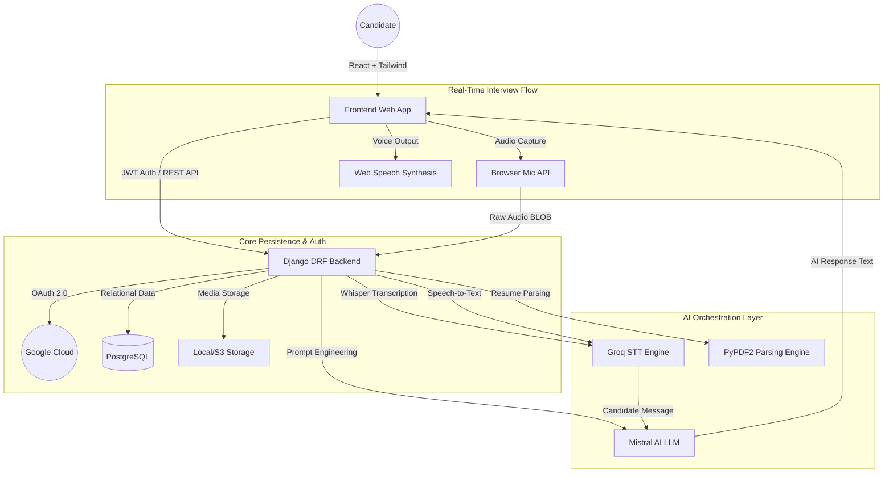

# 🚀 AI-Based Interview Platform

A cutting-edge, end-to-end recruitment solution that leverages Generative AI and Speech-to-Text technologies to conduct, analyze, and report on candidate interviews. The platform automates the initial screening phase by simulating a professional human interviewer through real-time audio interaction and deep resume analysis.

---

## 🏗️ System Architecture

The platform follows a modern **three-tier architecture** with micro-services for AI processing:



### 🛰️ Core Workflows:
1.  **Candidate Onboarding**: Google OAuth 2.0 integration for secure and seamless authentication.
2.  **Resume Analysis (ATS)**: Candidates upload PDFs; the backend parses skills, experience, and calculates an ATS score using LLM-driven keyword extraction.
3.  **Live Audio Interview**: 
    -   **Speech-to-Text (STT)**: Uses **Groq-powered Whisper-large-v3** for near-instant precision transcription of user audio.
    -   **Contextual LLM**: **Mistral AI** acts as the interviewer, tailoring behavioral questions based on the candidate's uploaded resume.
    -   **Audio Feedback**: AI responses are read back using the browser's `SpeechSynthesis` API.
4.  **Automated Reporting**: Post-interview, the system generates a detailed SWOT analysis (Strengths, Weaknesses, Opportunities, Threats) and a candidate percentile score.

---

## 🛠️ Technology Stack

### **Frontend**
- **React 18**: Single Page Application (SPA) framework.
- **Tailwind CSS**: Modern utility-first styling with "Glassmorphic" UI/UX.
- **Context API**: Global state management for authentication and theme.
- **Axios**: Promised-based HTTP client for API communication.
- **Web Speech API**: Native browser support for voice synthesis.

### **Backend**
- **Django 5.0 + Django REST Framework (DRF)**: High-performance Python backend.
- **PostgreSQL**: Robust relational database for user records and interview history.
- **JWT (SimpleJWT)**: Secure stateless authentication.
- **Django Allauth**: Google Social Authentication integration.

### **AI & Services**
- **Mistral AI (`mistral-small-latest`)**: High-accuracy LLM for interview orchestration and report generation.
- **Groq Cloud**: Ultra-fast infrastructure for Whisper STT processing.
- **PyPDF2**: Server-side PDF parsing for resume extraction.

---

## 🚦 Getting Started

### 📦 Prerequisites
- Python 3.10+
- Node.js 18+
- PostgreSQL
- API Keys: Mistral AI, Groq Cloud, Google OAuth Console

### 1️⃣ Backend Setup
```bash
cd backend
python -m venv venv
source venv/bin/activate  # .\venv\Scripts\activate on Windows
pip install -r requirements.txt
python manage.py migrate
python manage.py runserver
```
**Required .env variables:**
```env
DEBUG=True
SECRET_KEY=your_django_key
DB_NAME=postgres
DB_USER=postgres
DB_PASSWORD=your_password
MISTRAL_API_KEY=your_key
GROQ_API_KEY=your_key
GOOGLE_CLIENT_ID=your_id
GOOGLE_CLIENT_SECRET=your_secret
```

### 2️⃣ Frontend Setup
```bash
cd frontend
npm install
npm start
```

---

## 📊 Feature Overview

- **Smart Dashboard**: Visual representation of interview history, scores, and resume status.
- **Dynamic Interviewer**: Switches between 'Technical' and 'Behavioral' modes on the fly.
- **ATS Optimizer**: Upload resumes to see how they rank against target job roles.
- **Admin Panel**: Role-based access control (RBAC) to manage candidates and view platform analytics.
- **Dark/Light Mode**: Full theme customization across all components.

---

## 🛡️ Security & Scalability
- **Password Protection**: Prevents manual password resets for Google OAuth accounts.
- **Atomic Requests**: Database integrity during complex interview analytics.
- **JWT Rotation**: Secure token management and automatic logout on expiry.
- **Modular Services**: Decoupled STT and LLM logic allowing for easy provider swapping (e.g., OpenAI vs Mistral).

---

## 👨‍💻 Contributing
1.  Fork the Project
2.  Create your Feature Branch (`git checkout -b feature/AmazingFeature`)
3.  Commit your Changes (`git commit -m 'Add some AmazingFeature'`)
4.  Push to the Branch (`git push origin feature/AmazingFeature`)
5.  Open a Pull Request

---

## 📄 License
Distributed under the MIT License. See `LICENSE` for more information.
